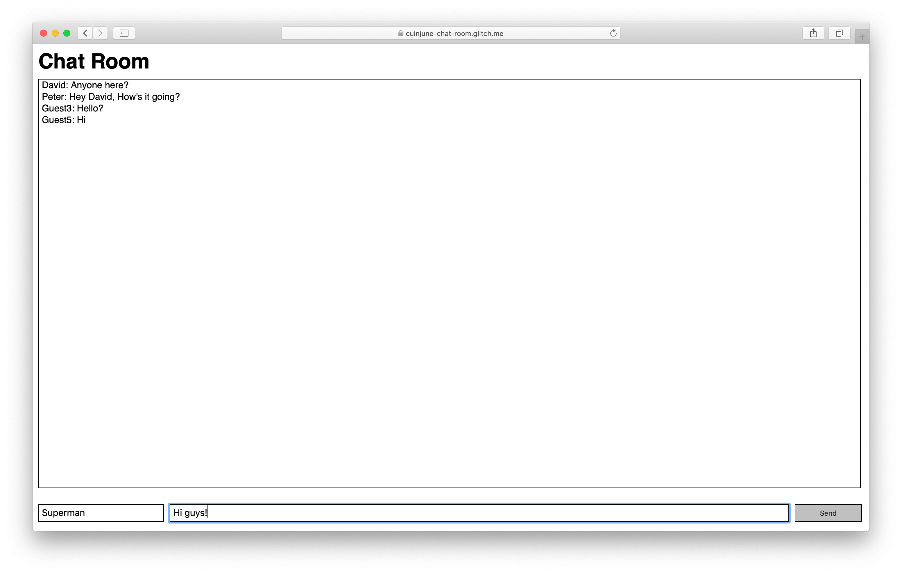

# Chat Room

This is the week 4 assignment for the ITP class Dynamic Web Development.<br />

This week, the assignment was to write server-side JavaScript to create an API that accepts AJAX request coming from a client-side web application to create, read, update, and delete data that are living on the server.

I decided to create a simple chat room application that anyone can use.

Here's the [Live Demo on Glitch](https://cuinjune-chat-room.glitch.me/)

And here you can find the [List of Chat Room APIs](API.md)

## Setup
1. Installation of node.js is required. Follow [this guide](https://github.com/itp-dwd/2020-spring/blob/master/guides/installing-nodejs.md) to install it.
2. Run the following commands in the Terminal.
```
git clone https://github.com/cuinjune/chat-room.git
cd chat-room
npm install dependencies
npm start
```
3. Open your web browser and navigate to http://localhost:3000

## Author
* [Zack Lee](https://www.cuinjune.com/about): MPS Candidate at [NYU ITP](https://itp.nyu.edu)
